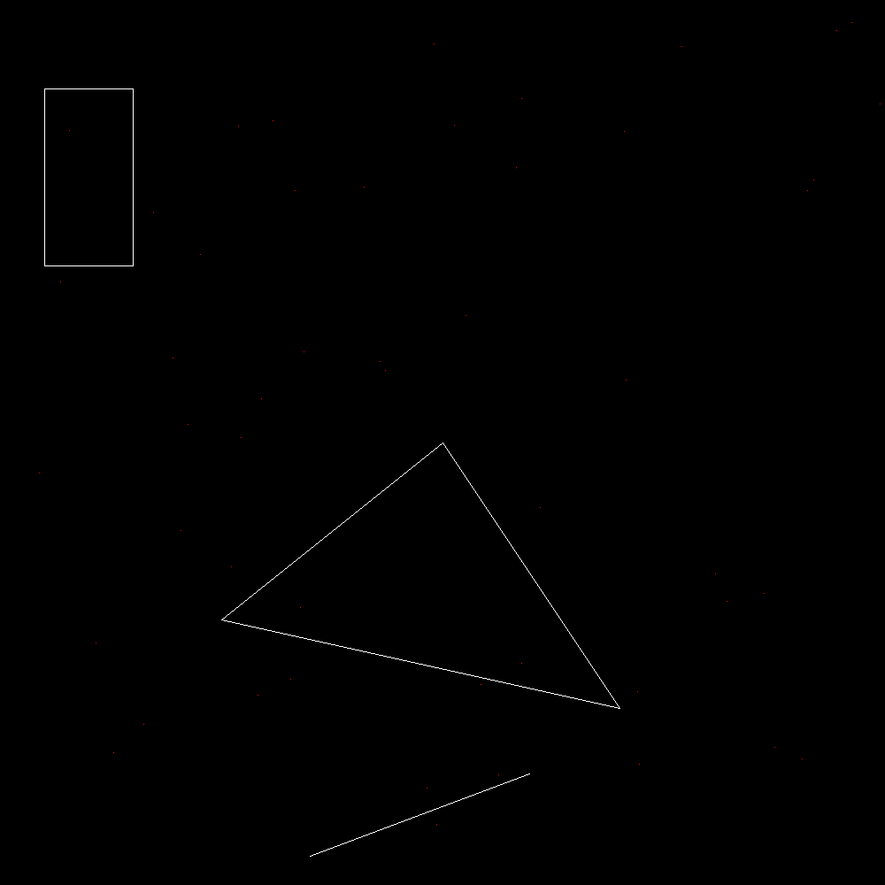

 # Drawing     
    This project consists of drawing shapes such as:    
    - Point     
    - Line      
    - Rectangle 
    - Triangle  
    - Circle    
We used a simple Bresenham's line algorithm to draw the line by joining two points.

L'output du moment     
